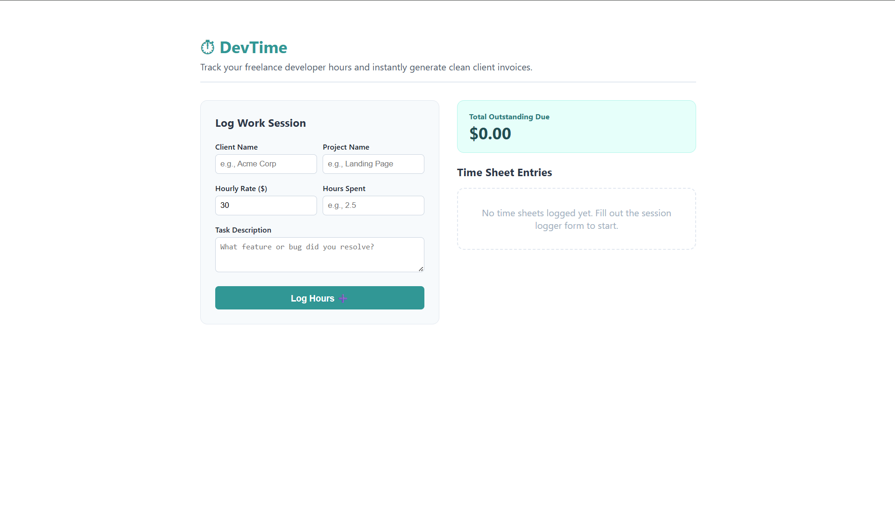

# ⏱ DevTime — Freelance Time Tracker & Invoice Generator
------------------------------------------------------------
DevTime is a lightweight developer productivity tool engineered with React that acts as a localized ledger for freelance project sessions. It tracks hours worked, multiplies live billing factors, saves state to local browser contexts, and builds pre-formatted Markdown itemized invoice receipts with a single click.

## Preview 

##  Technical Highlights
*  **Reactive Ledger Aggregations:** Uses React context tracking array configurations to map real-time totals instantly.
*  **Persistent Workspace Sync:** Integrates browser `localStorage` hooks to keep time cards secure through reboots.
*  **Dynamic String Exporting:** Compiles object lists into readable Markdown text layout summaries for easy distribution.

## Execution Instructions
1. Install packages: `npm install`
2. Run ecosystem: `npm run dev`
